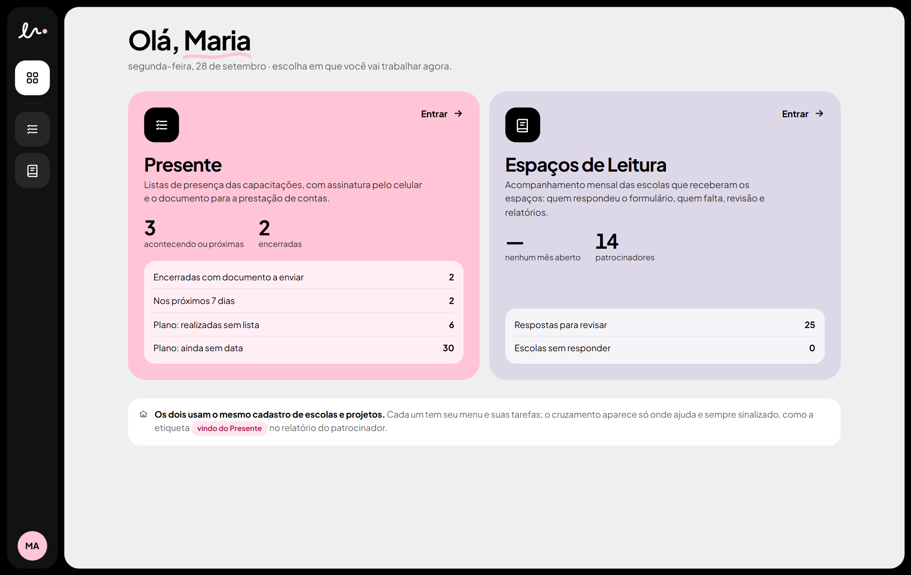
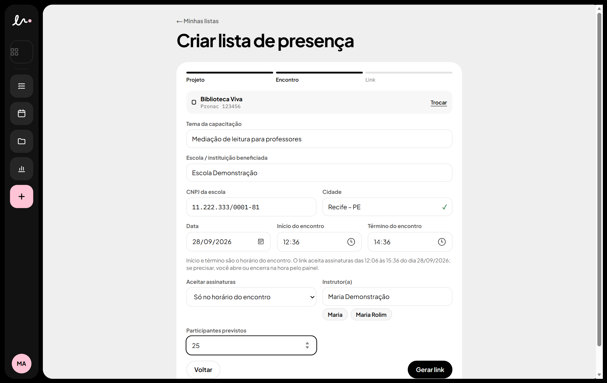
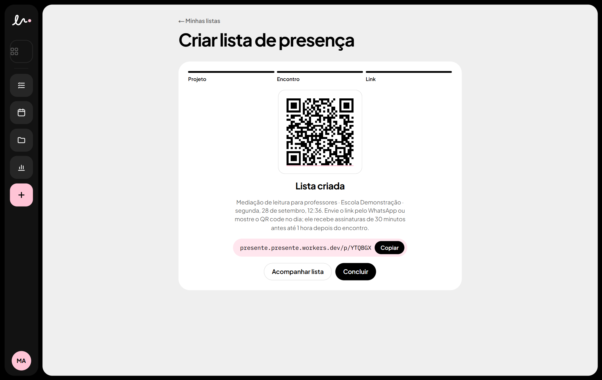
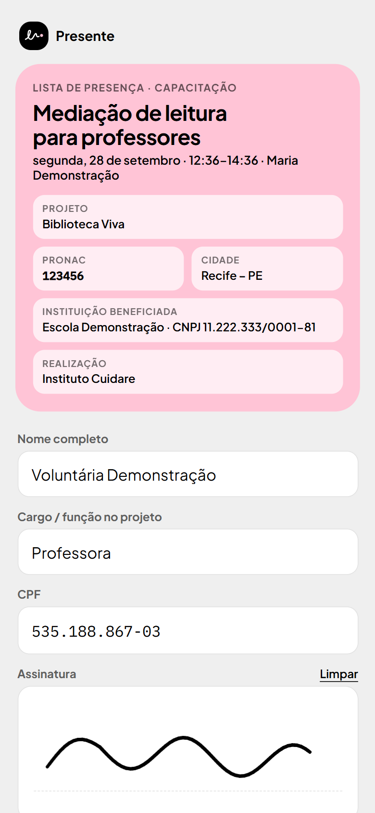
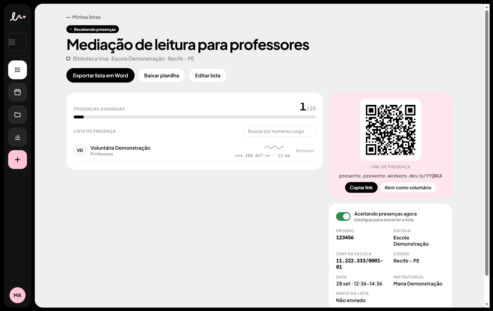
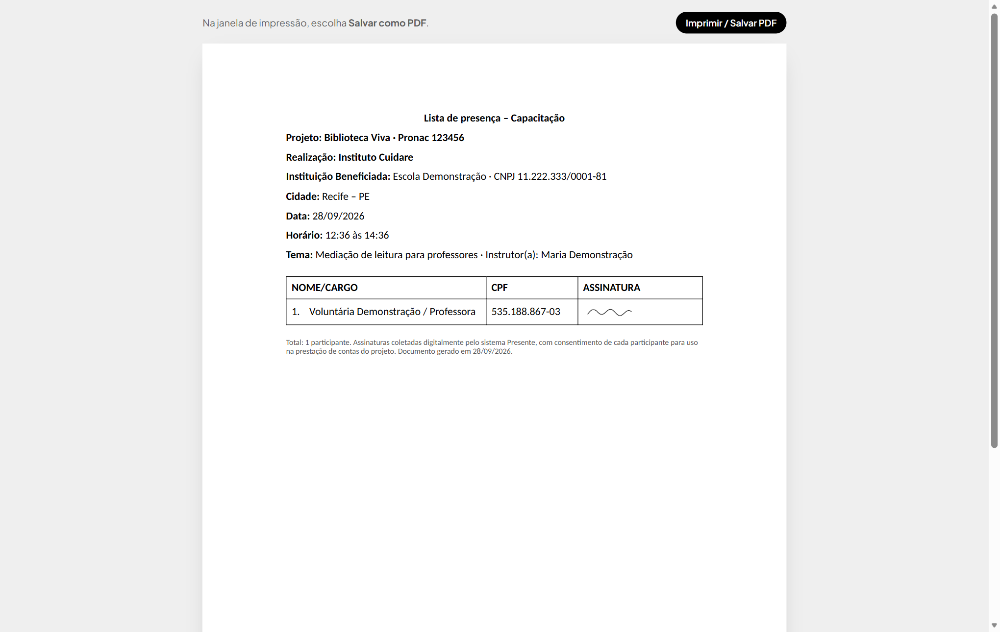
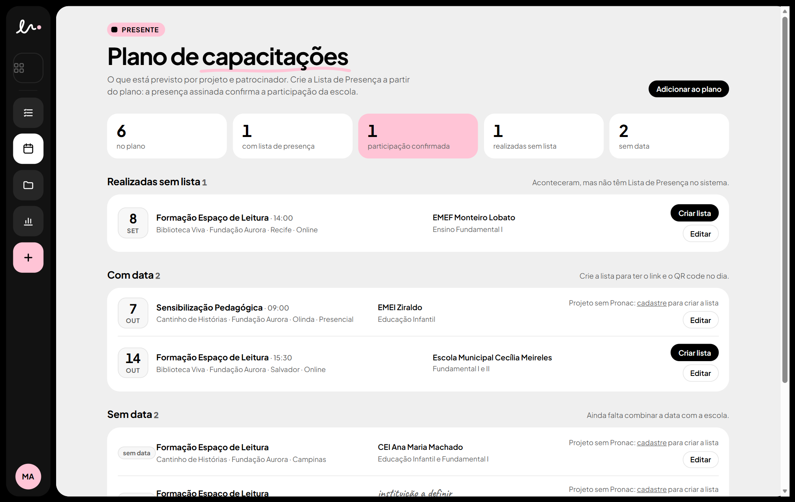
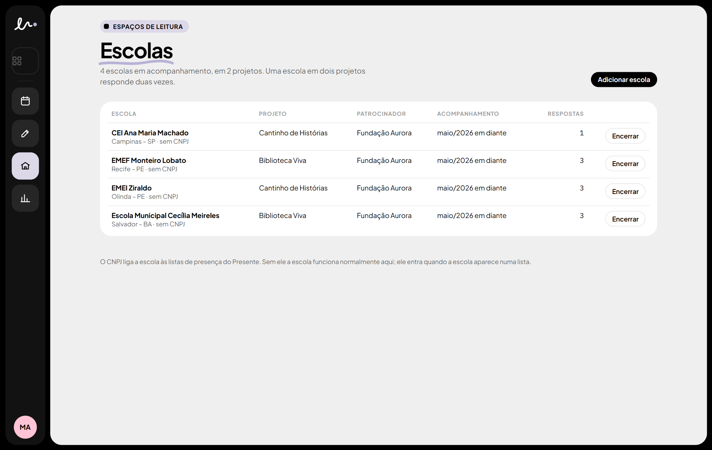
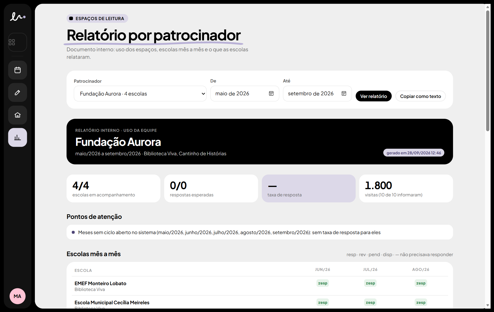

# ✍️ Presente

**A lista de presença das capacitações, assinada pelo celular. Sem imprimir, sem escanear, pronta para a prestação de contas.**

   

 

---

## ✨ O que ele faz

Antes, a lista de presença de cada capacitação era um Word impresso, assinado à mão, escaneado e enviado. O **Presente** troca tudo isso por um link:

1. A Equipe cria a lista e recebe um **link e um QR code**.
2. Cada voluntário abre no celular, informa **nome, cargo e CPF** e **assina com o dedo**.
3. A lista vai se preenchendo **ao vivo** no painel.
4. No fim, sai o **documento em Word no modelo da empresa**, com as assinaturas, pronto para a prestação de contas.

A tela inicial é a **Central**, com duas portas que usam o mesmo cadastro de escolas e projetos:

| Porta | Para quê |
|---|---|
| 🩷 **Presente** | listas de presença, plano de capacitações e avaliações das formações |
| 💜 **Espaços de Leitura** | acompanhamento mensal das escolas que receberam os espaços |

---

## 📝 Criar uma lista

1. Clique no **+** rosa do menu.
2. Escolha o **projeto** (o nome, o Pronac e o logo vão no cabeçalho do documento).
3. Preencha o **tema**, a **escola** (Instituição Beneficiada) com CNPJ e cidade, a **data** e o **horário**.
4. Clique em **Gerar link**.

A lista abre sozinha **30 minutos antes** do encontro e fecha **1 hora depois**. Para quem só consegue ver o material mais tarde, escolha em **Aceitar assinaturas**: *48 horas*, *72 horas* ou *7 dias*.

 

---

## 📱 O voluntário assina pelo celular

- Abre o link ou aponta a câmera para o QR code. **Não precisa instalar nada nem criar conta.**
- Vê os dados da capacitação, preenche nome, cargo e CPF e **assina com o dedo**.
- Confirma que leu **como seus dados são usados** (LGPD) e envia.

O sistema confere tudo antes de gravar: CPF válido, assinatura de verdade, lista aberta e o **mesmo CPF não assina duas vezes**.

 

---

## 👀 Acompanhar e entregar

- As assinaturas **aparecem na hora**, sem recarregar a página. No painel o CPF fica mascarado (`***.445.154-**`).
- **Exportar lista em Word** gera o documento no modelo oficial: logo do projeto, Pronac, Realização *Instituto Cuidare*, escola, cidade, tabela com nome/cargo, CPF e assinatura.
- **Baixar planilha** traz os mesmos dados para o Excel.
- Dá para **corrigir** os dados da lista, **abrir ou encerrar** na hora e **remover** uma assinatura feita por engano.

---

## 🗓️ Plano de capacitações

O plano do ano, por projeto e patrocinador, separado no que falta fazer: **realizadas sem lista**, **com data**, **sem data** e **com lista**.

- **Criar lista** num item abre o assistente **já preenchido** (projeto, tema, data, hora e escola) e deixa a lista ligada ao plano.
- Quando a lista recebe assinaturas, a **participação da escola fica confirmada**.
- Se já existe uma lista da mesma escola, o sistema **sugere ligar as duas**.

---

## 📚 Espaços de Leitura

O acompanhamento mensal das escolas: quem precisava responder o formulário do mês, quem respondeu e quem falta cobrar. As respostas do **Google Forms chegam sozinhas** (um script no formulário envia cada resposta).

| Tela | O que tem |
|---|---|
| **Mês** | quantas escolas precisavam responder, taxa de resposta e quem falta, com registro de contato e dispensa |
| **Revisão** | respostas que o sistema não fechou sozinho (escola não reconhecida, número escrito por extenso). **Nada muda sem a Equipe confirmar.** |
| **Escolas** | quem está em acompanhamento, em qual projeto e por quanto tempo |
| **Relatórios** | por patrocinador: grade mês a mês, relatos das escolas (**trechos literais, sem texto gerado por IA**) e pontos de atenção |

---

## 📊 Avaliações

As respostas do formulário **Avaliação – Formação de Professores** viram gráficos: satisfação, quantos recomendariam, uma barra por pergunta e os comentários, com filtro por projeto. O **QR code do formulário** fica na tela, para projetar no fim da formação. O e-mail de quem respondeu não é guardado.

---

## 🔒 Segurança e LGPD

- **Só a Equipe entra.** O cadastro público é desligado e o login tem limite de tentativas.
- **O banco fica fechado.** Nenhuma tabela aceita leitura ou gravação de quem não está logado. O voluntário só grava pela página de assinatura, e o servidor confere tudo antes.
- **O CPF completo** só sai no documento em Word e na planilha; no painel ele aparece mascarado.
- **Aviso de privacidade** na hora de assinar, com o contato para pedir acesso, correção ou exclusão dos dados.
- **Formulários do Google** só enviam com um segredo compartilhado.

---

## 🛠️ Para quem mantém o sistema

**Next.js 16** (App Router) + **Supabase** (Postgres, login e tempo real) + **Cloudflare Workers** via OpenNext. Regras para quem (ou qual IA) for mexer no código: [AGENTS.md](AGENTS.md). Vocabulário: [CONTEXT.md](CONTEXT.md). Por que é assim: [docs/adr/](docs/adr/).

<b>Rodar no computador</b>

 

1. Copie `.env.example` para `.env.local` e preencha com **Supabase → Project Settings → API Keys** (`NEXT_PUBLIC_SUPABASE_URL`, `NEXT_PUBLIC_SUPABASE_PUBLISHABLE_KEY` e `SUPABASE_SECRET_KEY`, que fica só no servidor).
2. `npm install` e `npm run dev`, depois abra http://localhost:3000.
3. `npm run check` confere se banco, chaves e usuários estão certos.

> ⚠️ `npm run dev` usa o **banco de produção**. Dados de teste levam "teste" no nome e são apagados ao terminar.

<b>Publicar</b>

 

Siga [AGENTS.md → Publicar](AGENTS.md#publicar): testes e tipos sem falha, migrações já rodadas no Supabase, **nenhuma lista recebendo assinaturas** (`npm run listas-abertas`), `npx opennextjs-cloudflare build && npx wrangler deploy` e conferir `/api/saude`. Se algo quebrar no ar: `npx wrangler rollback`.

<b>Banco de dados</b>

 

As mudanças ficam em [`supabase/migrations/`](supabase/migrations/), sempre **aditivas** e rodadas no SQL Editor do Supabase **antes** de publicar o código que depende delas. Toda tabela tem RLS só para a Equipe (`public.is_staff()`) e nenhuma permissão para anônimos.

<b>Assistentes e scripts</b>

 

| Comando | Para quê |
|---|---|
| `npm test` | testes das regras (janela de assinatura, CPF/CNPJ, documento, Espaços de Leitura, plano, avaliações) |
| `npm run assistente -- chave` | trocar a chave secreta do Supabase |
| `npm run assistente -- equipe` | criar usuário da Equipe |
| `npm run assistente -- migracao` | rodar uma migração e publicar |
| `npm run assistente -- formulario` | gerar o segredo dos formulários do Google |
| `npm run assistente -- turnstile` | ligar a verificação anti-robô |
| `npm run backup` | cópia do banco em `backups/` (tem CPFs: guarde em local protegido) |
| `npm run listas-abertas` | mostra listas recebendo assinaturas agora |
| `node scripts/prints-readme.mjs` | refaz os prints deste README |

Os scripts dos formulários do Google e o passo a passo de instalação estão em [`scripts/google-forms/`](scripts/google-forms/).

